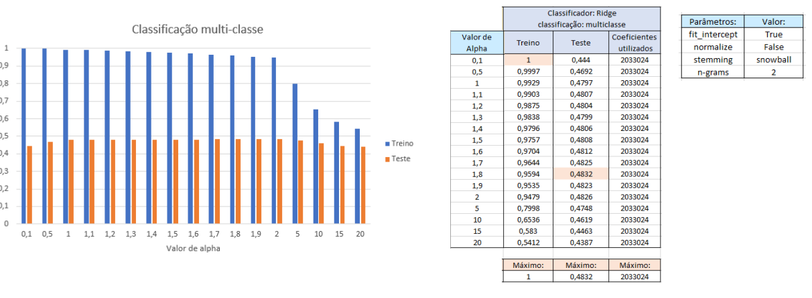
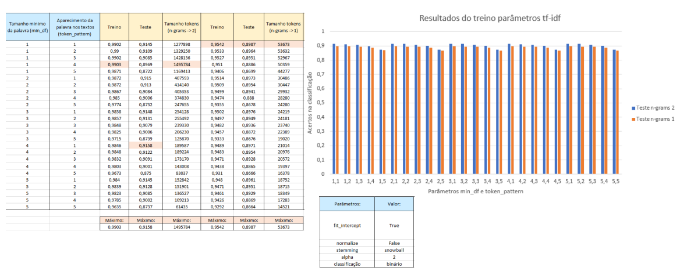

# Machine Learning for IMDb critics

This project aims to predict the IMDb rating given by a user based on the written comment. It has to solve two different tasks. The first one is predicting whether a critic's review is positive or negative. The second task is predicting the rating, which falls between 1 - 4 and 7 - 10. The steps are the following:

1. Cleanup special characters that are not relevant for classification (e.g., " "). 
2. Applied Stemming to convert related words into a single form to reduce the dimensionality. 
3. Apply TF-IDF to convert strings into tokens.
4. Apply a classifier to determine the results.

To achieve the best results, the system was fine-tuned using multiple variables and classifiers.

The best result obtained was **48.35%** in the multi-class task and **91.75%** in binary classification.

<table>
  <tr>
    <td></td>
</tr>
  <tr>
    <td style="text-align: center;"><em>1. Multi-class classification using different attributes</em></td>
  </tr>
</table>

<table>
  <tr>
    <td></td>
</tr>
  <tr>
    <td style="text-align: center;"><em>2. Binary classification using different attributes</em></td>
  </tr>
</table>

<table>
  <tr>
    <td></td>
</tr>
  <tr>
    <td style="text-align: center;"><em>3. Best results for multi-class classification</em></td>
  </tr>
</table>

<table>
  <tr>
    <td></td>
</tr>
  <tr>
    <td style="text-align: center;"><em>4. Best results for binary classification</em></td>
  </tr>
</table>

